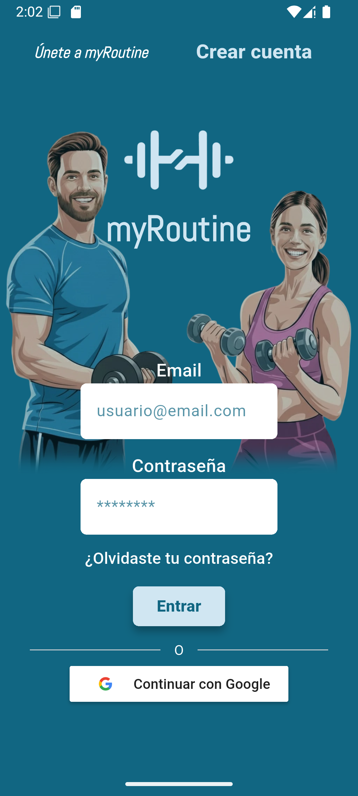
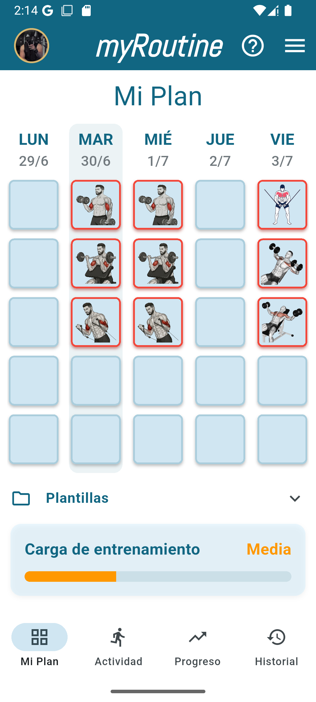
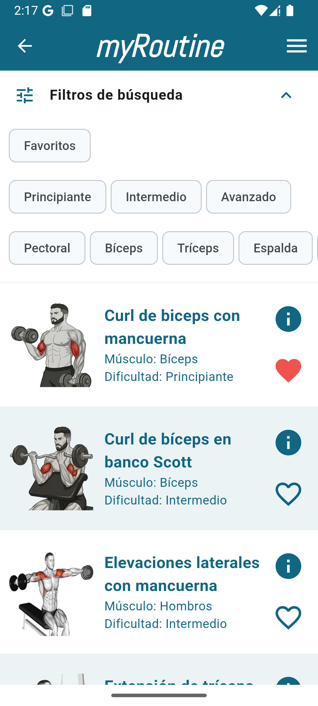
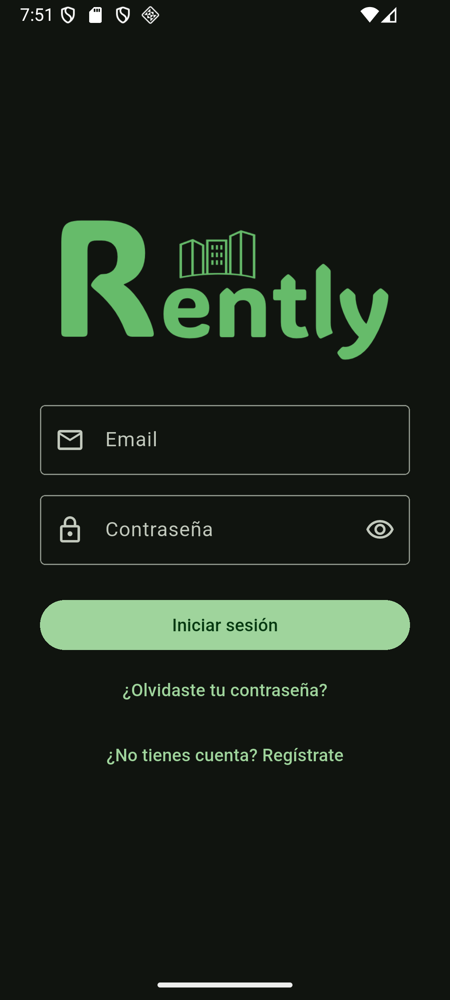
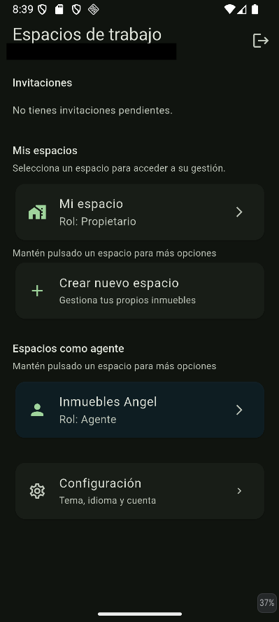
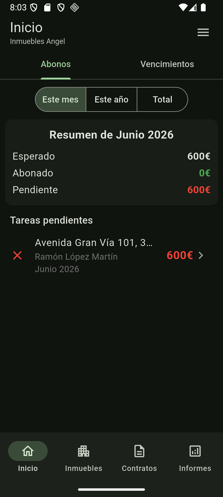
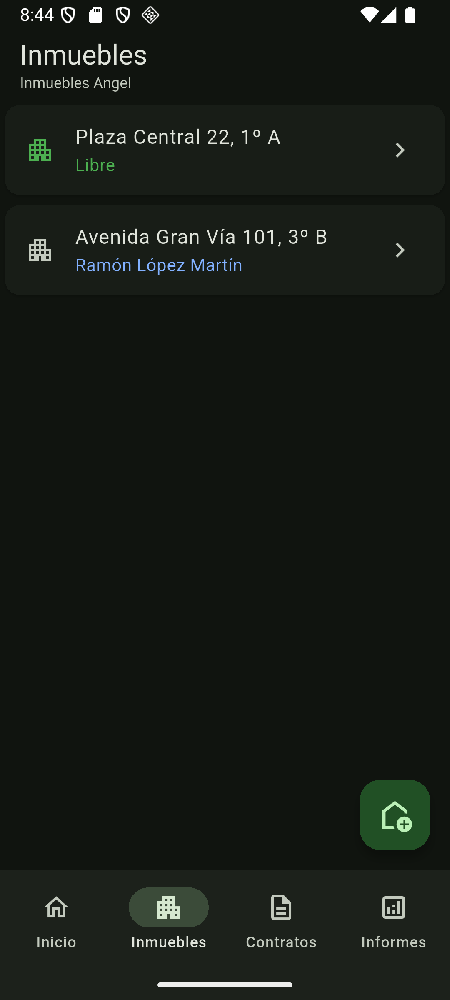
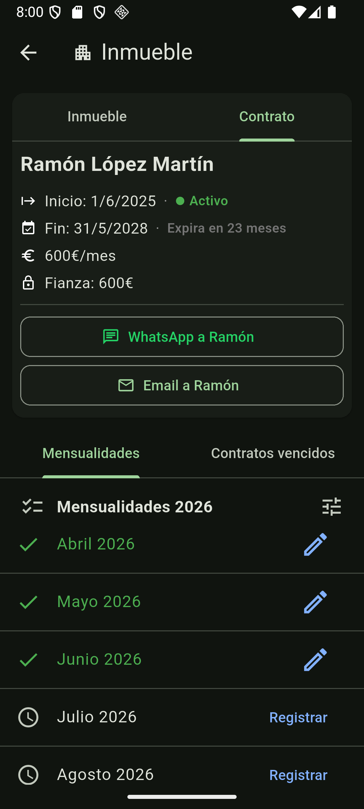
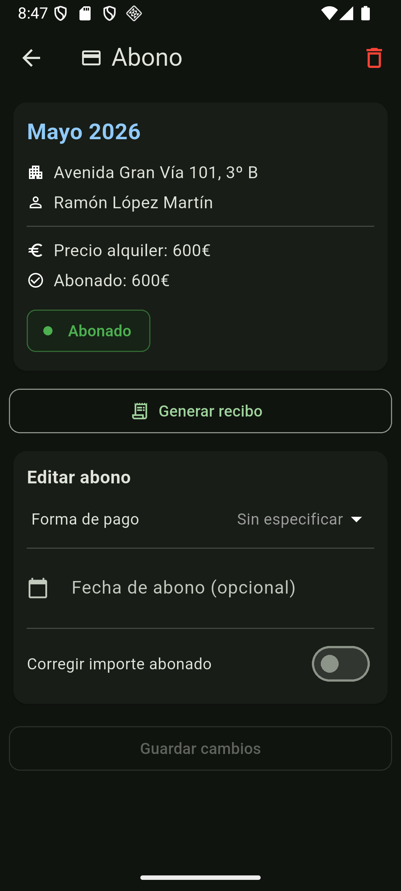

# 👋 Ángel Belzunce Abreu
### Desarrollador de Software · Apps Multiplataforma (Java · Kotlin · Flutter)

📍 Villablanca, Huelva &nbsp;|&nbsp; ✉️ angelbelzuncedev@gmail.com &nbsp;|&nbsp; 📱 669 068 698

---

## 🙋 Sobre mí

Técnico Superior en Desarrollo de Aplicaciones Multiplataforma (DAM), con conocimientos sólidos en **Java, Kotlin y Flutter/Dart**. Desarrollo mis proyectos de forma autónoma, cubriendo todo el ciclo: diseño, base de datos, lógica de negocio e interfaz. Me motiva aprender tecnologías nuevas y resolver problemas de forma independiente.

> Los repositorios de código de estos proyectos son privados. Este portfolio resume su funcionamiento, arquitectura y capturas de pantalla. Si quieres revisar el código a fondo, puedo darte acceso como colaborador — escríbeme.

---

## 🏋️ Proyecto 1 — App de gestión de planes de entrenamiento para gimnasios (MVP)

**Descripción:** aplicación móvil para crear, asignar y seguir rutinas de entrenamiento personalizadas en un gimnasio.

<!--
**Capturas:**

-->

<!-- Si grabas un vídeo demo, descomenta y sustituye el enlace:
🎥 [Ver demo en vídeo](https://link-a-tu-video)
-->

**Funcionalidades principales:**

- Creación y asignación de rutinas de entrenamiento personalizadas.
- Gestión de usuarios (usuario estandar y usuario PRO).
- Seguimiento de progreso y ejercicios completados.
- Autenticación de usuarios con **Firebase Authentication**.

**Stack técnico:**

`Flutter/Dart` · `Java` · `Firebase Firestore (NoSQL)` · `Firebase Authentication` · `Android Studio`

---

## 🏠 Proyecto 2 — App de gestión de alquileres de propiedades

**Descripción:** aplicación para gestionar de forma integral propiedades en alquiler: inquilinos, contratos, pagos y documentación.

**Capturas:**

<!-- Si grabas un vídeo demo, descomenta y sustituye el enlace:
🎥 [Ver demo en vídeo](https://link-a-tu-video)
-->

**Funcionalidades principales:**

- Gestión de propiedades, contratos de alquiler y generación de informes fiscales.
- Control de pagos asociados a cada propiedad.
- Gestión de roles (propietario, agente)
- Creación de espaciospropios, posibilidad de seleccionar agentes/gestores.
- Almacenamiento de documentos y archivos con **Firebase Storage** (póximamente).
- Despliegue mediante **Firebase Hosting** o **AndroidApp** (próximamente iOS).

**Stack técnico:**

`Flutter/Dart` · `Kotlin` · `Firebase Firestore (NoSQL)` · `Firebase Storage` · `Firebase Hosting` · `Firebase Authentication`

---

## 🛠️ Habilidades técnicas

| Categoría | Tecnologías |
|---|---|
| Lenguajes | Java, Kotlin, Dart, Python (básico) |
| Móvil | Flutter, Android Studio |
| Backend / BBDD | Firebase (Firestore, Authentication, Storage, Hosting), SQL, NoSQL |
| Herramientas | IntelliJ IDEA, Visual Studio Code, Git/GitHub, Claude Code, Antigravity |

---

## 📫 Contacto

¿Quieres hablar sobre alguno de estos proyectos o tienes una oportunidad para mí?

- ✉️ **Email:** angelbelzuncedev@gmail.com
- 💼 **LinkedIn:** [linkedin.com/in/ángelbelzunce](https://www.linkedin.com/in/%C3%A1ngelbelzunce/)
- 🐙 **GitHub:** [github.com/angelbelzunce](https://github.com/angelbelzunce)

